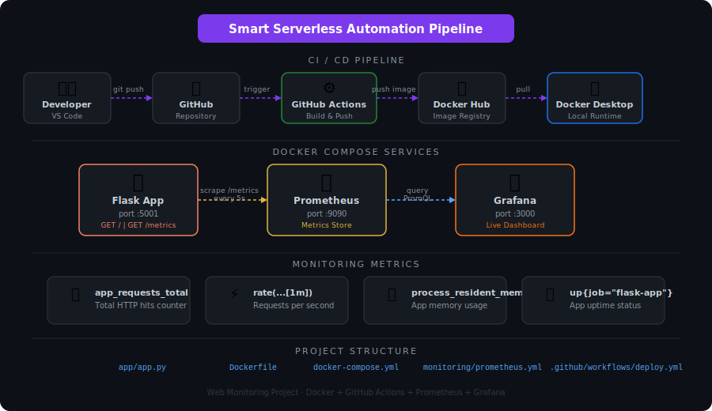

# 🚀 Web Monitoring Project

A Dockerized Flask app with GitHub Actions CI/CD and Prometheus + Grafana monitoring.

## Architecture



## How to Run

```bash
docker-compose up --build
```

## Services

| Service | URL |
|---------|-----|
| Flask App | http://localhost:5001 |
| Prometheus | http://localhost:9090 |
| Grafana | http://localhost:3000 |
